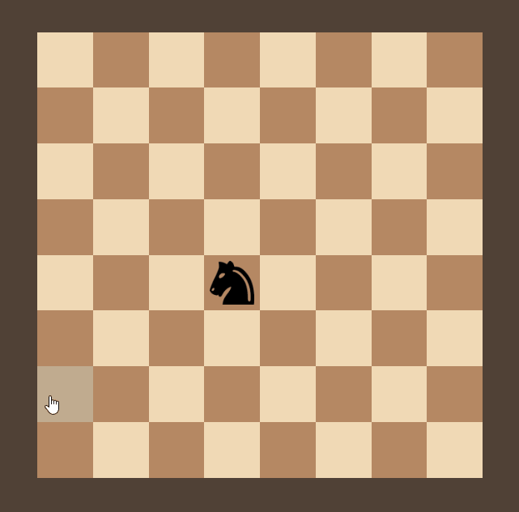

# Knight-travails
## [_Live Demo_](https://john0ground.github.io/Knight-travails/)

Based from [The Odin Project's](https://www.theodinproject.com/lessons/javascript-knights-travails) Javascript curriculum. The prior lessons explained some concepts about computer science.

## Task
Build a program that shows the shortest possible way for a knight to move from
one square to another.

_Concepts in the project include recursion, async/await, and undirected graph._

